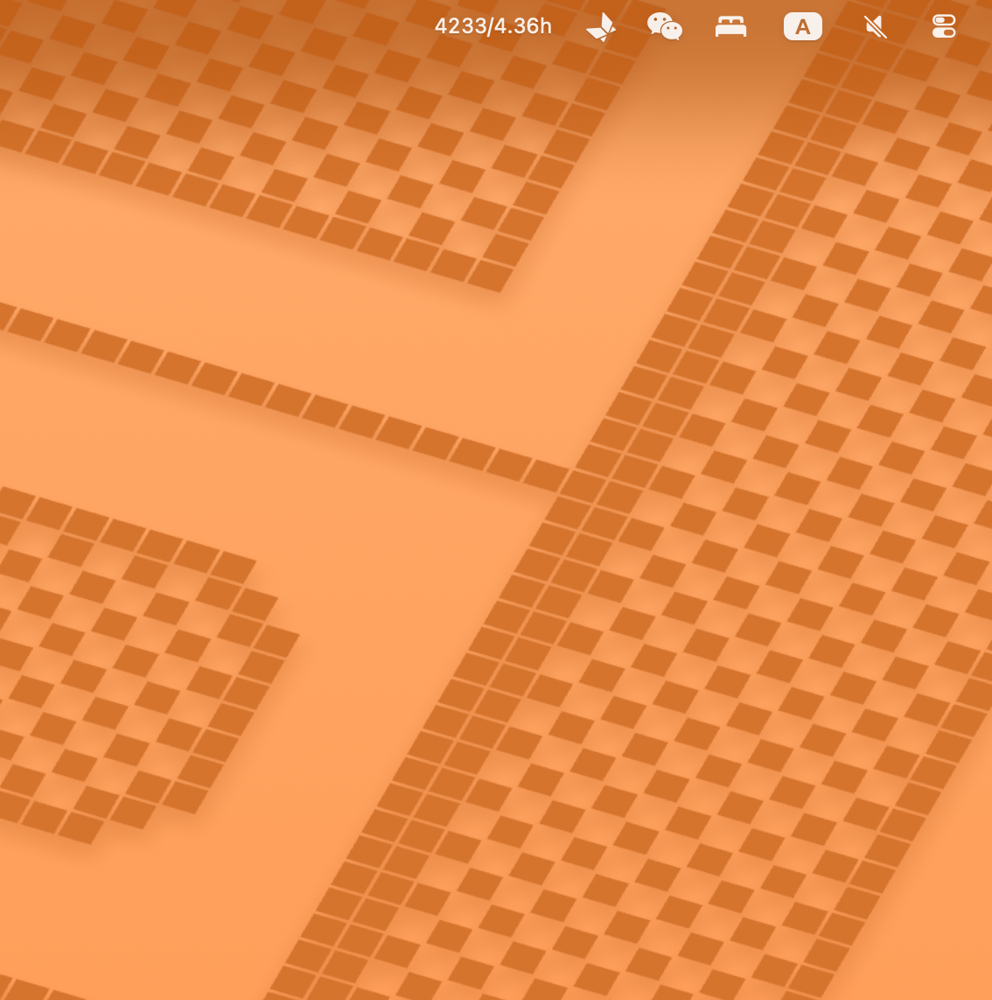
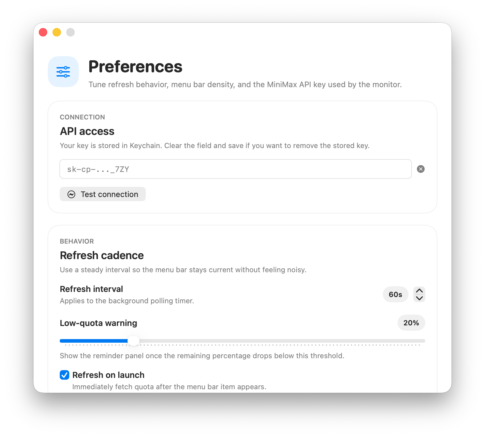

# MiniMax Usage Monitor

A macOS menu bar application for monitoring MiniMax API usage and quota.

## Features

- Menu bar widget displaying remaining quota
- Detailed usage view with per-model breakdown
- Quota trend charts for short-interval models
- Configurable refresh interval
- Warning notifications when quota runs low
- Secure API key storage via Keychain

## Screenshots

<!-- Menu Bar -->


<!-- Dropdown Menu -->


<!-- Settings -->


## Requirements

- macOS 14+
- MiniMax API key

## Build & Run

```bash
make build
make run
```

## License

This project is licensed under the MIT License - see [LICENSE](LICENSE) for details.

## Install

```bash
make install
```

## Configuration

1. Click the menu bar icon
2. Select **Settings**
3. Enter your MiniMax API key
4. Adjust refresh interval as needed
