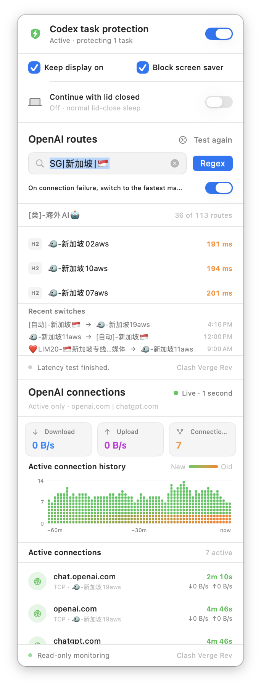
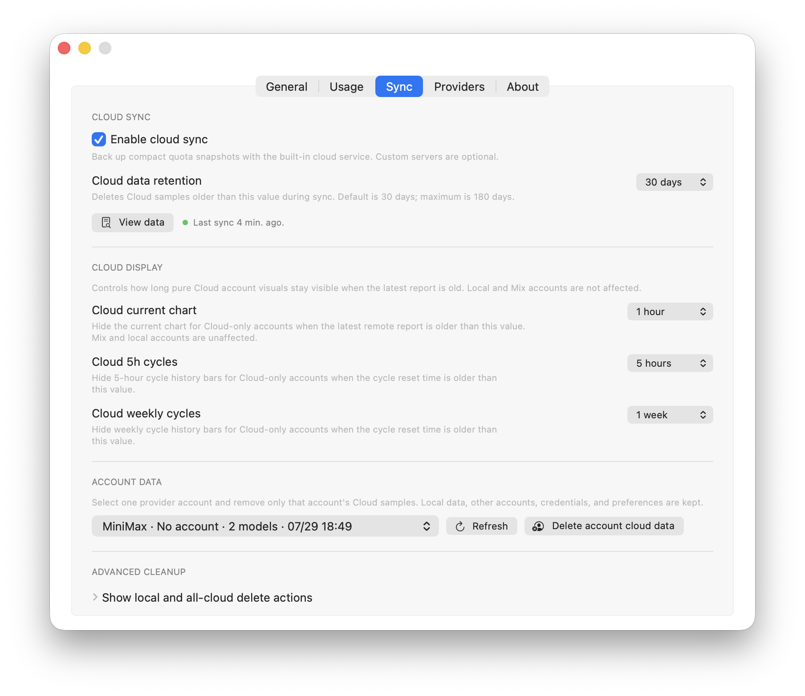

# AI Quota Bar

<p align="center">
  A native macOS menu bar companion for AI coding quota, Codex task protection, and OpenAI route recovery.
</p>

<p align="center">
  <a href="https://github.com/techfanseric/ai-quota-bar/releases/latest"></a>
  
  
  <a href="./LICENSE"></a>
</p>

<p align="center">
  <a href="./README.zh-CN.md">简体中文</a> ·
  <a href="https://github.com/techfanseric/ai-quota-bar/releases/latest/download/AIQuotaBar.dmg">Download DMG</a> ·
  <a href="https://github.com/techfanseric/ai-quota-bar/releases">Release notes</a>
</p>

AI Quota Bar keeps the information and controls needed during long AI-assisted development sessions in one compact menu bar app. Left-click shows quota and usage trends for Codex and MiniMax. Right-click opens a control center for active Codex tasks, Mac sleep protection, Clash/Mihomo OpenAI routes, and live OpenAI connections.

<p align="center">
  
</p>

## Highlights

| Area | What AI Quota Bar provides |
| --- | --- |
| Quota | Multi-account Codex and MiniMax quota, reset times, short-window trends, weekly pace, warnings, and a compact menu bar ring |
| OpenAI routing | Local Clash/Mihomo strategy-group discovery, latency testing, fuzzy country aliases, regex filtering, manual switching, and conservative outage recovery |
| Connections | Read-only `openai.com` / `chatgpt.com` active connections, aggregate transfer rates, connection count, and a 60-minute age-colored activity chart |
| Task protection | Detects active Codex tasks and holds display, screen-saver, and idle-sleep assertions only while work is in progress |
| Closed-lid mode | Optional administrator-installed helper with battery, thermal, heartbeat, task-completion, and maximum-duration cutoffs |
| Sync | Optional built-in cloud backup for compact quota snapshots, retention controls, remote account cleanup, and local data reports |

## Screenshots

### Quota dashboard

<p align="center">
  
</p>

### Menu bar quota ring

The outer ring shows Weekly remaining quota. The center shows whether current usage is ahead of or behind a sustainable pace. When both public OpenAI surfaces are unreachable, the ring changes to an offline state.

<p align="center">
  
</p>

### Cloud sync and retention

<p align="center">
  
</p>

## Requirements

- macOS 14 Sonoma or later.
- Apple Silicon for the prebuilt DMG. Source builds target the architecture of the build Mac.
- At least one quota provider:
  - Codex CLI installed and signed in.
  - MiniMax coding-plan bearer token.
- Optional: Clash Verge Rev, Mihomo, or Clash with a loopback-bound external controller.
- Optional: administrator approval to install the closed-lid helper.

## Install

1. Download the latest [`AIQuotaBar.dmg`](https://github.com/techfanseric/ai-quota-bar/releases/latest/download/AIQuotaBar.dmg).
2. Open the image and drag **AI Quota Bar** into **Applications**.
3. Launch the app and choose **Settings** from the left-click menu.

### Gatekeeper note

The public build is ad-hoc signed because the project does not currently use a paid Apple Developer certificate. It is not Apple-notarized. On first launch, macOS may require Control-clicking the app and choosing **Open**, or allowing it in **System Settings → Privacy & Security**. Do not disable Gatekeeper globally.

## Quick start

### Codex

Install the official Codex CLI, sign in once, and refresh AI Quota Bar:

```bash
codex
```

AI Quota Bar uses [`CodexBarCore`](https://github.com/steipete/CodexBar) to discover Codex accounts and quota sources. Settings exposes the same source choices:

- **Auto** — OAuth, CLI data, then local web session.
- **OAuth** — Codex CLI OAuth credentials only.
- **CLI** — local Codex/CodexBar configuration only.
- **Web** — local OpenAI browser session only.

Codex credentials stay in the local Codex/CodexBar account store. Multiple accounts are grouped separately in the quota dashboard.

### MiniMax

Open **Settings → Providers → MiniMax**, paste the bearer token used by the MiniMax coding-plan quota endpoint, and refresh. The token is stored in macOS Keychain.

## Quota and menu bar behavior

The menu bar can display Codex, MiniMax, or an automatic provider choice. Automatic mode prioritizes low remaining quota and unsustainable usage pace, then compares reset time.

For Codex:

- The primary short window is normally shown as **5h**.
- The secondary window is normally shown as **Weekly**.
- Credits and additional counters appear when the selected source reports them.
- Short windows use trend charts. Weekly uses a progress bar unless it is the only useful current-window trend, in which case it is promoted to a seven-day curve.
- The compact ring visualizes Weekly remaining quota and pace reserve/deficit without opening the menu.

Warnings and refresh intervals are configurable in Settings.

## OpenAI route recovery

AI Quota Bar discovers the local Clash/Mihomo external controller and resolves the switchable strategy group used by rules for `openai.com` or `chatgpt.com`. Only controller addresses bound to `127.0.0.1`, `localhost`, or `::1` are accepted.

Right-click the menu bar item to:

- Start a latency test and sort usable routes from fastest to slowest.
- Filter route names with ordinary text and country aliases such as `🇯🇵`, `日本`, or `JP`.
- Enable regex mode for anchors, alternation, and exact route naming rules.
- Switch routes manually.
- Review the latest three route changes.

Automatic recovery is deliberately outage-driven:

1. Both `openai.com` and `chatgpt.com` must fail two consecutive connectivity checks.
2. AI Quota Bar tests only routes matching a non-empty, valid filter.
3. Candidates are tried from lowest latency upward.
4. Connectivity is rechecked after each switch.
5. A macOS notification reports successful recovery.

Opening the panel, pressing **Test again**, or enabling the option never switches the route by itself.

## Live OpenAI connections

The right-click control center reads the Clash/Mihomo connections stream and keeps only active connections matching the fixed `openai|chatgpt` domain rule.

It shows:

- Aggregate download and upload rates.
- Total active connection count.
- A 60-minute stacked activity chart sampled once per minute.
- One block per connection, colored from green for new connections toward orange for long-lived connections.
- A compact active-connection list with host, process, network, route, age, and current rates when available.

Monitoring is read-only. AI Quota Bar does not terminate or rewrite Clash connections.

## Codex task protection

AI Quota Bar detects active local Codex tasks through Codex hooks and a read-only local-state fallback. It looks only for task lifecycle events; task prompts and responses are not uploaded.

When protection is enabled and at least one task is active, the app can:

- Keep the display awake.
- Block the screen saver.
- Prevent idle system sleep.

These are temporary macOS power assertions. They are released when the last task finishes, protection is disabled, or AI Quota Bar exits.

### Continue with the lid closed

Closed-lid mode is optional, off by default, and separate from the ordinary no-sleep assertions. The first enable installs a small privileged helper after an administrator prompt. The helper leases the required `pmset` state and restores the previous value when any safety condition fires:

- The Codex task finishes.
- The app disconnects or stops sending heartbeats.
- Battery falls below the safety threshold.
- macOS reports serious or critical thermal pressure.
- The 12-hour maximum lease expires.
- The user disables the feature.

Closing a MacBook lid can reduce cooling. Use this mode only with adequate ventilation and power conditions.

## Cloud sync and data

Cloud sync is optional. When enabled, a successful refresh uploads compact quota history to the built-in Cloudflare service so recent charts can be restored and inspected across devices.

Cloud payloads include a generated device ID, provider and account labels, model names, quota values, reset times, and utilization history. Provider secrets are not uploaded: MiniMax tokens remain in Keychain and Codex credentials remain in the local Codex/CodexBar store.

Settings provides:

- Cloud retention from 30 to 180 days.
- Visibility limits for stale current, short-cycle, and weekly data.
- A local HTML data report.
- Per-account remote deletion.
- Full local or remote cleanup under Advanced Cleanup.

The Worker and D1 schema are available in [`cloudflare/`](./cloudflare/) for development and self-hosting work. The current release UI uses the built-in endpoint.

## Privacy and security boundaries

- MiniMax credentials are stored in macOS Keychain.
- Codex credentials are managed locally by Codex/CodexBar.
- Clash/Mihomo access is limited to a loopback external controller.
- Connection monitoring is read-only.
- Codex task detection reads local lifecycle state and does not upload task content.
- Cloud sync is opt-in and never uploads provider credentials, but it does upload the quota metadata listed above.
- Closed-lid changes require explicit administrator approval and are automatically restored by the helper.

## Build from source

The Swift package currently expects CodexBar as a sibling checkout:

```bash
mkdir ai-quota-bar-workspace
cd ai-quota-bar-workspace
git clone https://github.com/steipete/CodexBar.git codexbar
git clone https://github.com/techfanseric/ai-quota-bar.git
cd ai-quota-bar

make build
make install
```

Build requirements:

- Xcode Command Line Tools with Swift 5.9 or later.
- macOS 14 SDK or later.
- `hdiutil`, `iconutil`, `sips`, and `codesign`, which ship with macOS/Xcode tools.

Useful commands:

```bash
swift test       # run the test suite
make build       # release binaries
make app         # assemble dist/AIQuotaBar.app
make install     # replace /Applications/AIQuotaBar.app and relaunch
make package     # create dist/AIQuotaBar.dmg
```

By default, `make package` uses ad-hoc signing. Set `CODESIGN_IDENTITY` to a suitable Developer ID identity if you maintain a signed/notarized distribution pipeline.

## Troubleshooting

### Clash routes are unavailable

- Confirm Clash/Mihomo is running.
- Enable its external controller.
- Bind the controller to a loopback address.
- Ensure the active rules for `openai.com` or `chatgpt.com` lead to a switchable strategy group.

### Automatic recovery does not switch

- Both public domains must fail twice.
- The auto-recovery switch must be on.
- The route filter must be non-empty and valid.
- At least one matching route must complete a latency test.

### Codex protection says no task is active

- Confirm Codex is currently executing, not waiting for input.
- Keep the Codex state directory at the default `~/.codex`, or set `CODEX_HOME` consistently.
- Restart AI Quota Bar once after upgrading so its bundled lifecycle hook can be registered.

### Closed-lid mode is unavailable

Use the feature switch once while the app is in the foreground and approve the administrator prompt. Installing a new app build changes the helper fingerprint, so the helper may require a one-time update.

## Acknowledgements

- [`CodexBar`](https://github.com/steipete/CodexBar) for `CodexBarCore`.
- Clash, Mihomo, and Clash Verge Rev for the local controller APIs used by route and connection monitoring.

## License

AI Quota Bar is released under the [MIT License](./LICENSE).
