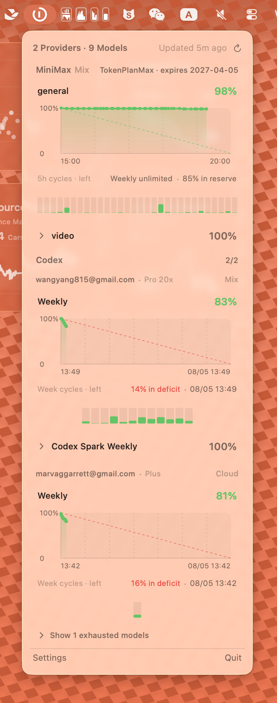
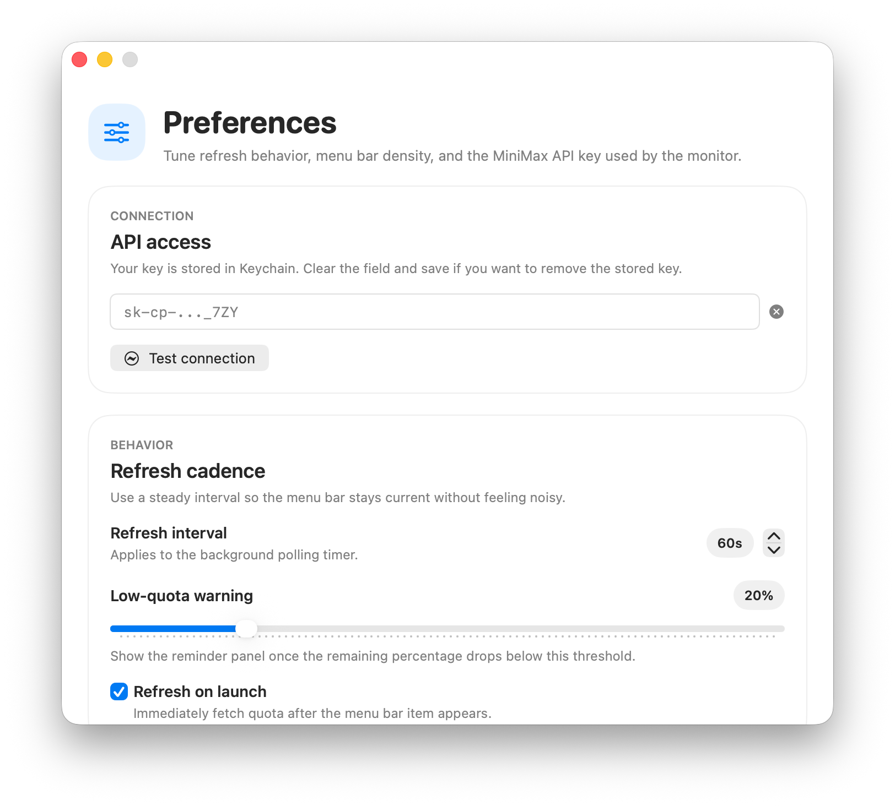

# AI Quota Bar

A macOS menu bar application for monitoring model coding plan quota across providers.

AI Quota Bar is focused on coding-plan consumption: it tracks the remaining quota for supported AI coding models, shows per-model breakdowns, and warns you before a short-interval or subscription quota runs out. It currently supports MiniMax and Codex coding quota snapshots.

## Features

- Menu bar widget displaying remaining coding-plan quota
- Configurable menu bar provider selection and compact quota ring
- Detailed per-provider and per-model usage breakdown
- Quota trend charts for short-interval model limits
- Automatic menu bar fallback to the used model with the soonest reset when the displayed quota expires
- Right-click menu bar shortcut for cycling through used short-interval models
- Configurable refresh interval
- Warning notifications when quota runs low
- Secure provider credential storage via Keychain
- Optional cloud backup of quota snapshots through your own Cloudflare Worker + D1 database

## Screenshots

<!-- Menu Bar -->


<!-- Dropdown Menu -->


<!-- Settings -->


## Requirements

- macOS 14+
- MiniMax API key, Codex CLI installed and signed in (`codex` command available), or both

## Build & Run

```bash
make build
make run
```

## License

This project is licensed under the MIT License - see [LICENSE](LICENSE) for details.

## Install

```bash
make install
```

## Configuration

1. Click the menu bar icon
2. Select **Settings**
3. Enter a MiniMax API key, sign in to Codex via the `codex` CLI, or configure both providers
4. Configured providers refresh together and appear as separate sections in the menu
5. Adjust refresh interval as needed

## Menu bar behavior

The menu bar item shows one provider at a time. **Displayed provider** can be set to Automatic, Codex, or MiniMax. Automatic prioritizes providers with low remaining quota or an unsustainable usage pace, then compares remaining quota and reset time.

**Appearance** can be set to Detailed text or Compact ring. For Codex, the compact ring's outer stroke shows Weekly consumption. Its split center circle fills left for deficit and right for reserve. **Pace detail** lets you choose a fine-grained continuous percentage or glanceable staged levels. At startup and during a user-triggered refresh, the ring runs at least one complete self-test pass that sweeps Weekly usage and cycles through deficit, on-pace, and reserve; live data returns after that pass and the refresh have both finished. Background timer refreshes stay visually quiet. If both `chatgpt.com` and `openai.com` are unreachable, the center becomes a no-entry glyph while the last quota ring remains visible. Other providers keep their compact provider initial. Hover the item for the exact quota, pace, reset time, and connectivity state.

Left-click the menu bar item to open the detailed dropdown. Right-click it to quickly cycle through used short-interval models, which are the models shown with trend charts in the dropdown rather than long-window progress bars.

## MiniMax support

For MiniMax, paste the bearer token used by the MiniMax coding plan remains endpoint. The app calls the MiniMax coding plan quota API and maps the returned model quota windows into the menu bar and dropdown views.

## Codex support

Codex quota is fetched by reusing the [`codexbar`](https://github.com/steipete/CodexBar) project as a local SwiftPM dependency (`CodexBarCore`). AI Quota Bar does not talk to ChatGPT/OpenAI endpoints directly; instead it wraps codexbar's `ProviderDescriptor` and lets codexbar choose the best available source:

- `primary_window` is shown as `5h`, with remaining quota displayed as a percentage and reset shown as a time.
- `secondary_window` is shown as `Weekly`, with remaining quota displayed as a percentage and reset shown as a date.
- Extra rate-limit windows returned by codexbar (for example the Codex CLI's secondary counters) are mapped to additional rows in the dropdown.
- `Credits` balance is shown when codexbar reports it.
- Plan details such as Plus or Pro are shown when returned by the response.
- Multiple Codex accounts can be configured and displayed separately, each with its own account header in the dropdown.

The Codex section in Settings exposes a **Source mode** picker that matches codexbar's `ProviderSourceMode`:

- `Auto` — try OAuth, then the local `codex` CLI, then the OpenAI web session, in that order.
- `OAuth` — only use the local Codex CLI's OAuth credentials.
- `CLI` — only use the `~/.codex` and `~/.codexbar` config directories read by the CLI.
- `Web` — only use the OpenAI web session scraped through the local browser cookie store.

To add a Codex account, sign in through the official `codex` CLI once on this Mac:

```bash
codex        # follow the OAuth / sign-in prompt
```

AI Quota Bar reads the same `~/.codex` directory the CLI writes to, so no extra paste-in step is required. New accounts are picked up automatically by the **Refresh** action in Settings; the **Sign out** button clears the local Codex credentials through codexbar's managed account store. The **Remove** button only hides the account from AI Quota Bar's list without touching the underlying CLI credentials.

The pre-2.0 single-account ChatGPT/Codex GPT flow (paste session JSON or curl) has been removed. Existing stored credentials are not migrated; please re-connect through the `codex` CLI after upgrading.

## Cloud backup

AI Quota Bar can back up quota snapshots to a Cloudflare D1 database through a small Worker in `cloudflare/`.
Provider credentials are not uploaded; MiniMax credentials remain in macOS Keychain, and Codex accounts live in codexbar's managed account store under `~/.codexbar`.

See `cloudflare/README.md` for the Cloudflare setup steps, then paste the deployed Worker URL and sync token into Settings.
After setup, use **Settings -> Cloud backup -> View remote data** to open a local HTML report of the remote D1 data. The fallback command is `cloudflare/view-remote-data.command`.

## Release highlights

### 2.0.0

- Rewrote the Codex/ChatGPT provider on top of the `codexbar` project's `CodexBarCore` library.
- Replaced the pasted session-JSON / curl setup with `codex` CLI sign-in and codexbar's managed account store.
- Added a Source mode picker (Auto / OAuth / CLI / Web) and multi-account support that mirrors codexbar.
- Mapped the Codex rate-limit windows (`5h` and `Weekly`) plus the credits balance into the menu and dropdown, grouped by account.
- Dropped pre-2.0 ChatGPT Keychain credentials; please re-connect through `codex` CLI after upgrading.

### 1.4.0

- Added optional Cloudflare Worker + D1 cloud backup for quota snapshots.
- Added a Settings shortcut to view remote stored quota data as a local HTML report.
- Kept provider credentials local in Keychain while storing only compact quota history remotely.
- Added launch-at-login preferences and improved model grouping for exhausted/full quota rows.

### 1.3.2

- Added right-click menu bar cycling for used short-interval quota windows.
- Improved automatic menu bar fallback so expired or exhausted selections rotate to the soonest reset among active, already-used models.
- Skipped full, unused quota windows during active-model cycling.
- Added README coverage for multi-account ChatGPT setup introduced after 1.3.0.

### 1.3.1

- Fixed ChatGPT short-window quota chart detection.
