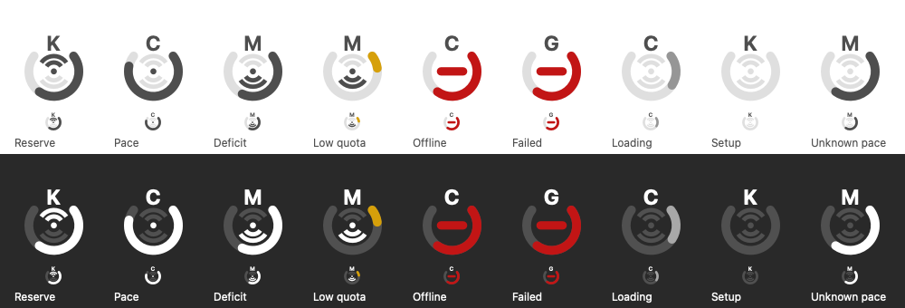
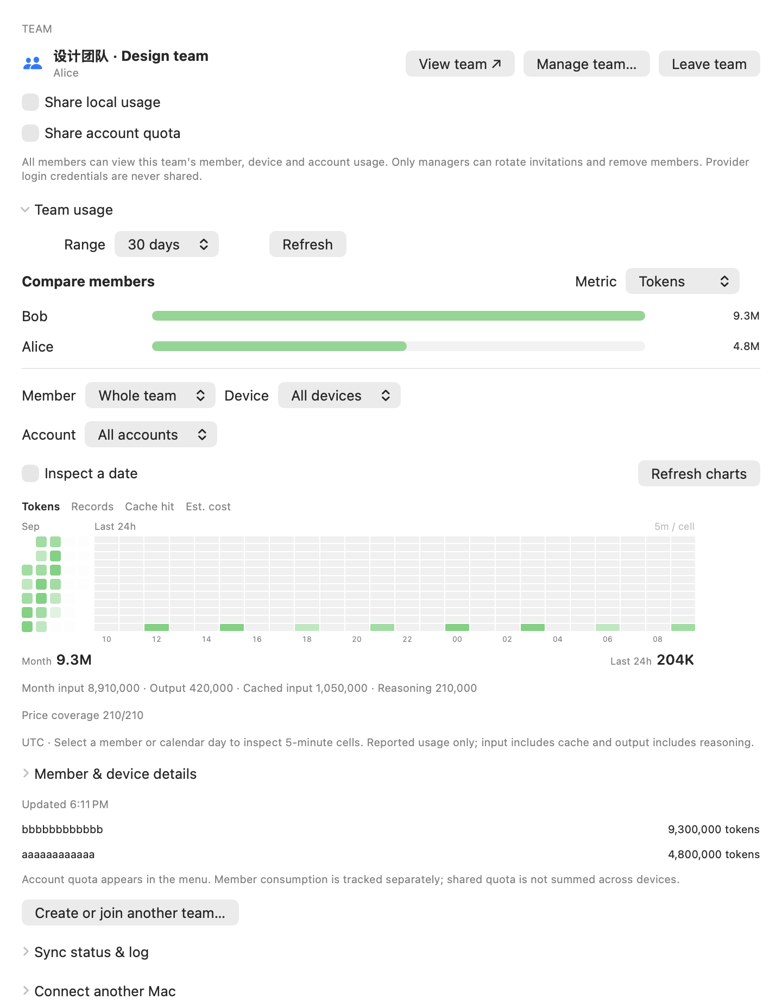

# AI Quota Bar

[Product website & interactive demos](https://ai-quota-bar.pages.dev/)

<p align="center">
  Know how much AI coding time you have left, keep long Codex tasks running, and recover OpenAI connections without leaving the menu bar.
</p>

<p align="center">
  <a href="https://github.com/techfanseric/ai-quota-bar/releases/latest"></a>
  
  
  <a href="./LICENSE"></a>
</p>

<p align="center">
  <a href="./README.zh-CN.md">简体中文</a> ·
  <a href="https://github.com/techfanseric/ai-quota-bar/releases/latest/download/AIQuotaBar.dmg">Download DMG</a> ·
  <a href="https://github.com/techfanseric/ai-quota-bar/releases">Release notes</a>
</p>

AI coding work is hard to manage when quota, network routes, and Mac sleep settings live in different places. AI Quota Bar brings them together: left-click to see whether your quota can support the work ahead, and right-click to keep Codex running or repair a slow or broken OpenAI connection.

<p align="center">
  
</p>

## New in v1.24.0

Kimi now automatically discovers desktop and web sessions alongside CLI credentials. Saved API keys remain preferred, and Settings show the most recently successful source.

[v1.24.0 release notes](./docs/releases/v1.24.0.en.md)

## v1.23.1 · Calmer menu text, website preview aligned

The MiniMax subscription line in the menu drops the repeated "expires" wording and shows just the date, and long subscription subtitles shrink slightly instead of truncating. The homepage team-panel preview reproduces the released /team dashboard, and legacy demo styles that collided with the real chart classes were removed.

[v1.23.1 release notes](./docs/releases/v1.23.1.en.md)

## v1.23.0 · Lower background load, visible storage and delivery

Fix repeated menu-bar frame generation and full-history usage processing while retaining monitoring intervals and 30 fps animation. A ten-minute single-machine run averaged 9.07% process CPU versus 95.39% for the old build; results vary by machine and workload. Settings now show storage, delivery states and a cloud verification action. Oversized quota uploads causing HTTP 413 are fixed. The interface loads 35 days while older disk records remain intact.

[v1.23.0 release notes](./docs/releases/v1.23.0.en.md)

## v1.22.0 · Clearer icons and accurate GLM status

Larger **bidirectional fan** icons make pace easier to read: upper segments mean reserve, lower segments mean deficit, and a center dot means on pace. A wider opening separates the persistent provider letter from the ring. Yellow warns of low quota; a red dash means unavailable. Launch, menu-bar, warning, mobile and website icons share the same design.



GLM now follows the selected weekly quota for its ring and pace. Its 5h chart uses actual samples even when reset metadata is missing. Supported personal web credentials also show available reset allowances and the next expiry, without redeeming them.

[Full changes since v1.21.0](./docs/releases/v1.22.0.en.md), including team-dashboard refinements.

## What’s new in v1.21.0

Quota-reset dates are marked on the usage calendar, with exact times on hover. Matrix callouts follow their cells, and the website recreates the team settings and usage charts. [Published changelog](https://ai-quota-bar.pages.dev/en/changelog).

## What’s new in v1.20.0

**Create teams in Settings and open your team without signing in again.** Usage & Team now defaults to creation, offers an explicit create/join-and-switch flow, and loads team usage automatically. Every member can open a read-only team dashboard; managers enter directly with credentials saved in macOS Keychain. Existing managers enter their password once to enable this.

**See who used how much:** member comparison bars, monthly calendars and 288 five-minute cells for the last 24 hours. Select a day to inspect its details, filter by member/device/account, and switch tokens, records, cache hit or cost. Available in Settings and the team dashboard.

Browser handoff links last two minutes and can be used once. Members can inspect their team's members, devices, usage and quota accounts, but cannot delete data, revoke devices or rotate invitations. Cross-team controls remain in `/admin`. This release also corrects website previews against the native app, including overlapping hero heatmap cells.

[Website](https://ai-quota-bar.pages.dev) · [Changelog](https://ai-quota-bar.pages.dev/changelog) · [Full v1.20.0 release notes](./docs/releases/v1.20.0.md)

## What’s new in v1.17.1

30-day Codex usage matrix, clearer first-run guidance, cached Keychain credentials, discreet update reminders, and sync diagnostics in Settings. The website now shows both click panels and light/dark landscape/portrait dashboards.

[Website](https://ai-quota-bar.pages.dev) · [Changelog](https://ai-quota-bar.pages.dev/changelog) · [Full v1.17.1 release notes](./docs/releases/v1.17.1.md)

## What it helps you do

| Your goal | How AI Quota Bar helps |
| --- | --- |
| Plan work before quota runs out | See remaining Codex, Kimi, GLM, and MiniMax quota, reset times, recent usage, and whether your current pace is sustainable |
| Get OpenAI working again quickly | Test and switch Clash/Mihomo routes from the menu bar, or let the app recover automatically after a real outage |
| Understand a slow connection | See whether OpenAI has active traffic, whether data is moving, and whether old connections are piling up |
| Let long Codex tasks finish | Keep the Mac awake only while Codex is working, then return to normal automatically |
| Monitor from another screen | Install the local Mobile Dashboard on a phone to follow quota, tasks, routing, connections, and protection live |
| Close the lid when necessary | Optionally keep a task running with safety cutoffs for battery, heat, lost contact, and maximum duration |
| Keep useful history | Optionally sync recent quota snapshots so trends remain available across Macs |

## Screenshots

### Quota dashboard

See every account in one place. The remaining percentage answers “how much is left,” while the trend and reserve/deficit message answer the more useful question: “at this pace, am I likely to make it to the reset?”

<p align="center">
  
</p>

### A quick answer without opening the menu

The menu bar ring shows Weekly quota at a glance. Its center tells you whether you have room to spare or are spending faster than the quota can sustain. While Codex is working, one flowing highlight per active task travels only through the remaining part of the ring, up to five waves. If both OpenAI sites become unreachable, the ring changes to an offline warning.

<p align="center">
  
</p>

### Usage & Team

Create or join a team, inspect member and device summaries, and control local usage reporting and account quota sharing independently.

<p align="center"></p>

## Requirements

- macOS 14 Sonoma or later.
- Apple Silicon for the prebuilt DMG. Source builds target the architecture of the build Mac.
- At least one quota provider:
  - Codex CLI installed and signed in.
  - A Kimi Desktop sign-in, web session, Kimi Code CLI sign-in, or Kimi Code API key.
  - A GLM Coding Plan API key, or a quota-request cURL copied from the GLM usage page.
  - MiniMax coding-plan bearer token.
- Optional: Clash Verge Rev, Mihomo, or Clash with a loopback-bound external controller.
- Optional: administrator approval to install the closed-lid helper.

### Kimi data sources

No source setup is needed. Auto detects a saved API key → valid Desktop sign-in → saved web session → CLI → accessible browser sign-in. Unavailable local credentials are skipped; network/server errors after selecting a valid login do not switch accounts. Manual overrides remain under Settings → Providers → Kimi → Advanced.

- Desktop supports the newer encrypted Kimi token store and legacy cookies. Click **Allow Desktop Access** if macOS Keychain authorization is needed. Background refresh never prompts.
- Web automatically detects accessible kimi.com browser sessions without Keychain prompts. Scan results are cached for five minutes. Multiple accounts require a choice in Advanced, which also supports explicit browser import and manual kimi.ai sign-in.
- Sign in again when Desktop credentials expire; re-import an expired web session. AI Quota Bar never modifies Kimi's credentials or refresh tokens.
- Code short-window and weekly limits are shown separately from the membership total when provided. Mainland Desktop has been verified on a real installation; overseas endpoints have not.

## Install

1. Download the latest [`AIQuotaBar.dmg`](https://github.com/techfanseric/ai-quota-bar/releases/latest/download/AIQuotaBar.dmg).
2. Open the image and drag **AI Quota Bar** into **Applications**.
3. Launch the app and choose **Settings** from the left-click menu.

### Gatekeeper note

The public build is ad-hoc signed because the project does not currently use a paid Apple Developer certificate. It is not Apple-notarized. On first launch, macOS may require Control-clicking the app and choosing **Open**, or allowing it in **System Settings → Privacy & Security**. Do not disable Gatekeeper globally.

## Quick start

### Codex

If Codex already works in Terminal, setup is almost finished. Sign in once with the official CLI, then refresh AI Quota Bar:

```bash
codex
```

Your Codex accounts appear automatically and stay grouped separately. Credentials remain in the local Codex/CodexBar account store.

<details>
<summary>Advanced: choose where Codex quota is read from</summary>

AI Quota Bar uses [`CodexBarCore`](https://github.com/steipete/CodexBar) and offers these source choices:

- **Auto** — OAuth, CLI data, then local web session.
- **OAuth** — Codex CLI OAuth credentials only.
- **CLI** — local Codex/CodexBar configuration only.
- **Web** — local OpenAI browser session only.

</details>

### Kimi

Sign in to Kimi Desktop, then refresh AI Quota Bar. Leave the API key blank and use the default Automatic source under **Settings → Providers → Kimi**. A readable browser session also works. To use the CLI fallback, sign in once:

```bash
kimi
```

AI Quota Bar reads quota by sending `/status` to the real CLI in a local PTY. This local slash command does not create a model turn or consume context tokens, and the official CLI remains responsible for refreshing its login. You can alternatively store a Kimi Code API key in macOS Keychain.

### GLM

Open **Settings → Providers → GLM**, enter a personal GLM Coding Plan API key, test the connection, and save. Five-hour and weekly credit quotas are supported; credentials stay in macOS Keychain. Alternatively, open the [BigModel usage page](https://bigmodel.cn/coding-plan/personal/usage), use DevTools → Network → Copy as cURL on the `quota/limit` request, and paste it into settings. Web credentials must be copied again when the session expires.

### MiniMax

Open **Settings → Providers → MiniMax**, paste your MiniMax coding-plan token, and refresh. The token stays in macOS Keychain.

## Monitor work from a phone

Open **Settings → Mobile Dashboard**, enable the local dashboard, and scan the QR code from a device on the same network. The page can be installed as a PWA and reconnects through a stable local hostname when the network supports it, with explicit IP fallbacks available when it does not.

The dashboard is designed as an always-on monitor:

- Select one or two quota models and follow the same native quota curves, reset times, and pace guidance used by the Mac app.
- See the exact active Codex task count, task-specific telemetry, current route, connection activity, and sleep-protection state without exposing controls that modify the Mac.
- Choose digital rain, dot waves, or Task telemetry barrage for the Codex Activity background. Every telemetry field is individually configurable.
- Use automatic, light, or dark appearance; optional OLED shifting; and a full-screen IDLE screen saver after a fresh confirmed idle signal.
- Optionally enable experimental background media after a tap on the phone when a display should remain awake. Browser and operating-system power policies may still override it.

Manual pairing is optional. When enabled, the short code expires after five minutes and is exchanged for a revocable install credential; the credential is not embedded in saved links. Sharing task progress text is available only in this paired mode and stays off until explicitly enabled.

## Plan work before quota runs out

AI Quota Bar does more than show a percentage. It combines remaining quota, reset time, and recent pace so you can decide whether to continue a large task now, slow down, or move work to another account.

- Track Codex, Kimi, GLM, and MiniMax from one menu, including multiple Codex accounts.
- See both short limits such as **5h** and longer limits such as **Weekly**.
- Use the trend line to see how quickly quota is falling.
- Use the reserve/deficit message to see whether your current pace can last until reset.
- Receive a warning before a limit becomes a surprise.
- Use the compact ring when you only need a quick glance.

You can pin one provider in the menu bar or let Automatic mode surface whichever account needs attention first.

## Get OpenAI working again without opening Clash

When ChatGPT or Codex stops connecting, right-click the menu bar icon. AI Quota Bar finds the relevant local Clash/Mihomo group, tests its routes, and puts the fastest working choices first.

- Search by country in the way that feels natural: `🇯🇵`, `日本`, and `JP` all work.
- Turn on regex when you need precise route-name rules.
- Recognize common protocols such as Hysteria2, VLESS, and AnyTLS from compact badges without opening a second line of detail.
- Switch manually with one click and review the last three changes.
- Keep a filter such as a preferred country, then optionally let the app choose the fastest match when OpenAI is genuinely down.

Automatic recovery is intentionally cautious. It does nothing when you merely open the panel, run a speed test, or enable the option. It starts only after both `openai.com` and `chatgpt.com` fail twice in a row, tries filtered routes from fastest to slowest, stops as soon as connectivity returns, and then sends a notification.

For safety, AI Quota Bar accepts only Clash/Mihomo controllers on this Mac (`127.0.0.1`, `localhost`, or `::1`).

## Understand slow or stuck OpenAI traffic

When ChatGPT feels slow, the connection panel helps answer three quick questions:

- **Is anything connected?** See the active OpenAI/ChatGPT connection count.
- **Is data actually moving?** See total upload and download speed.
- **Is this a fresh request or a long-lived connection?** New connections are green and gradually turn orange as they age.

The 60-minute chart makes spikes, quiet periods, and connections that remain active unusually long easy to spot. The list below shows the host, protocol, route, age, and speed when Clash/Mihomo provides them.

This view is read-only: it never closes or changes your connections.

## Let long Codex tasks finish unattended

Start a long Codex task and step away without changing the Mac’s sleep settings for the whole day. AI Quota Bar detects when Codex is actually working and can keep the display awake, block the screen saver, and prevent idle sleep only for that active period.

When the last task finishes—or when you disable protection or quit the app—the Mac immediately returns to its normal behavior. Multiple simultaneous tasks are counted, so protection does not end early while another task is still running. The compact ring mirrors that count with up to five flowing waves, so you can confirm work is still active without opening the control center.

### Continue with the lid closed

If you occasionally need to close a MacBook while a task finishes, you can enable closed-lid mode separately. It is off by default and asks for administrator approval the first time.

The helper restores your previous sleep setting when:

- The Codex task finishes.
- The app disconnects or stops sending heartbeats.
- Battery falls below the safety threshold.
- macOS reports serious or critical thermal pressure.
- The 12-hour maximum lease expires.
- The user disables the feature.

This is a safety net, not a replacement for ventilation. A closed MacBook can cool less effectively, so use the option only when the machine has suitable airflow and power.

## Manage a team’s usage

Open **Settings → Usage & Team** to create a team. Its management password is saved in Keychain; keep a separate backup and share only the invite code with members. Members join with an invite code, member name and member passphrase. Creating or joining enables member reporting and quota sharing; each can be paused independently. Use the same member passphrase on another Mac. Leaving revokes the current device credential.

- Local statistics work without a team.
- **View team** opens the member dashboard directly, with no password entry. Members see each other’s usage, devices and quota accounts in read-only mode.
- **Manage team** opens management directly for saved credentials; existing managers enter the management password once.
- **Create or join another team** switches this Mac only after success; usage already assigned to the old team stays there.
- Other teams cannot read, change or delete this team’s data.
- Quota history is retained for 90 days. Owners clean up team accounts or revoke member devices in `/team`.
- Platform operators use independently authenticated `/admin` for cross-team data, legacy records, database usage and deletion audit.
- Shared data includes usage statistics, quota metadata and account labels (which may contain email addresses), never provider credentials or conversations.

## Privacy and security boundaries

- MiniMax credentials are stored in macOS Keychain.
- GLM API keys and imported web-request credentials are stored in macOS Keychain.
- Optional Kimi API keys and explicitly saved web sessions are stored in macOS Keychain. Desktop and browser sessions are read locally; CLI credentials remain managed by Kimi Code.
- Codex credentials are managed locally by Codex/CodexBar.
- Clash/Mihomo access is limited to a loopback external controller.
- Connection monitoring is read-only.
- Codex task detection reads local lifecycle state and does not upload task content.
- The Mobile Dashboard is served only on the local network, exposes a read-only status surface, and masks account names by default.
- Mobile task progress text is omitted unless manual pairing is enabled and the user separately opts in to sharing it.
- Cloud sync is opt-in and never uploads provider credentials, but it does upload the quota metadata listed above.
- Closed-lid changes require explicit administrator approval and are automatically restored by the helper.

## Codex local usage and member reporting

The menu and Usage settings show local tokens, usage records, weighted cache hit rates and estimated costs with configurable prices. Optional reporting groups usage by team member and device, independently of account quota. Reporting starts when you create or join a team and can be paused independently. See the [setup, deployment and verification guide](docs/codex-local-usage.md).

## Build from source

See [`docs/README.md`](./docs/README.md) for the architecture and maintenance documentation index.

The Swift package currently expects CodexBar as a sibling checkout:

```bash
mkdir ai-quota-bar-workspace
cd ai-quota-bar-workspace
git clone https://github.com/steipete/CodexBar.git codexbar
git -C codexbar checkout b6e65a83dc471817b7ff7678e68e0204c9dd604f
git clone https://github.com/techfanseric/ai-quota-bar.git
cd ai-quota-bar

make build
make install
```

Build requirements:

- Xcode Command Line Tools with Swift 5.9 or later.
- macOS 14 SDK or later.
- `hdiutil`, `iconutil`, `sips`, and `codesign`, which ship with macOS/Xcode tools.

Useful commands:

```bash
swift test       # run the test suite
make build       # release binaries
make app         # assemble dist/AIQuotaBar.app
make install     # replace /Applications/AIQuotaBar.app and relaunch
make package     # create dist/AIQuotaBar.dmg
```

By default, `make package` uses ad-hoc signing. Set `CODESIGN_IDENTITY` to a suitable Developer ID identity if you maintain a signed/notarized distribution pipeline.

## Troubleshooting

### Clash routes are unavailable

- Confirm Clash/Mihomo is running.
- Enable its external controller.
- Bind the controller to a loopback address.
- Ensure the active rules for `openai.com` or `chatgpt.com` lead to a switchable strategy group.

### Automatic recovery does not switch

- Both public domains must fail twice.
- The auto-recovery switch must be on.
- The route filter must be non-empty and valid.
- At least one matching route must complete a latency test.

### Codex protection says no task is active

- Confirm Codex is currently executing, not waiting for input.
- Keep the Codex state directory at the default `~/.codex`, or set `CODEX_HOME` consistently.
- Restart AI Quota Bar once after upgrading so its bundled lifecycle hook can be registered.

### Closed-lid mode is unavailable

Use the feature switch once while the app is in the foreground and approve the administrator prompt. Installing a new app build changes the helper fingerprint, so the helper may require a one-time update.

## Acknowledgements

- [`CodexBar`](https://github.com/steipete/CodexBar) for `CodexBarCore`.
- Clash, Mihomo, and Clash Verge Rev for the local controller APIs used by route and connection monitoring.

## License

AI Quota Bar is released under the [MIT License](./LICENSE).
