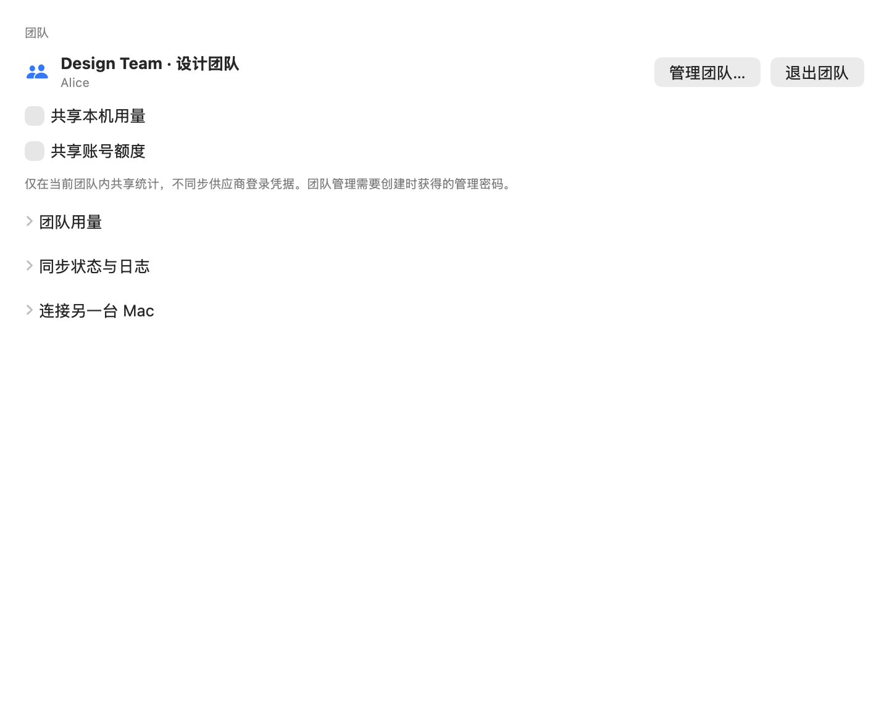

# AI Quota Bar

[产品介绍与交互演示](https://ai-quota-bar.pages.dev/)

<p align="center">
  随时知道 AI 编程配额还能用多久，让 Codex 长任务不中断，并在 OpenAI 连不上时直接从菜单栏恢复线路。
</p>

<p align="center">
  <a href="https://github.com/techfanseric/ai-quota-bar/releases/latest"></a>
  
  
  <a href="./LICENSE"></a>
</p>

<p align="center">
  <a href="./README.md">English</a> ·
  <a href="https://github.com/techfanseric/ai-quota-bar/releases/latest/download/AIQuotaBar.dmg">下载 DMG</a> ·
  <a href="https://github.com/techfanseric/ai-quota-bar/releases">版本记录</a>
</p>

做 AI 编程时，配额在一个地方、代理线路在另一个地方，Mac 睡眠设置又在第三个地方。AI Quota Bar 把这些事情放进菜单栏：左键判断当前配额够不够完成接下来的工作，右键让 Codex 安心跑完长任务，或者快速处理 OpenAI 连接异常。

<p align="center">
  
</p>

## v1.19.0 有什么变化

用量与同步合并为「用量与团队」：在 App 内直接创建或加入团队，统一查看成员、设备、账号和同步状态。不同团队的数据、凭证、缓存和上传队列隔离；团队管理员在 `/team` 管理本团队，跨团队统计、旧数据、D1 和删除审计统一放在 `/admin`。

**升级提示：**旧版共享同步凭证不再可用。升级后创建或加入团队即可继续共享；本机统计不受影响，旧云端数据保留只读，不会按账号名自动归入团队。团队配额历史统一保留 90 天。

[官网](https://ai-quota-bar.pages.dev) · [更新日志](https://ai-quota-bar.pages.dev/changelog) · [完整 v1.19.0 发布说明](./docs/releases/v1.19.0.md)

## v1.17.1 有什么变化

Codex 用量改为 30 天矩阵，完善新手引导、钥匙串缓存与低打扰更新提醒。左键菜单移除快捷暂停和云错误，设置增加同步日志。官网补齐左右键面板，以及横屏亮色、竖屏暗色的真实看板演示。

[官网](https://ai-quota-bar.pages.dev) · [更新日志](https://ai-quota-bar.pages.dev/changelog) · [完整 v1.17.1 发布说明](./docs/releases/v1.17.1.md)

## 它能帮你解决什么

| 你遇到的问题 | AI Quota Bar 如何帮你 |
| --- | --- |
| 不知道配额能不能撑到工作完成 | 同时展示剩余量、重置时间、近期消耗和当前节奏是否可持续 |
| ChatGPT 或 Codex 突然连不上 | 直接在菜单栏测试和切换 Clash/Mihomo 线路，真正故障时也可自动恢复 |
| 感觉连接很慢，却不知道卡在哪里 | 查看当前有没有连接、是否真的在传输，以及是否堆积了持续很久的连接 |
| Codex 跑长任务时担心 Mac 睡着 | 只在 Codex 工作期间保持唤醒，任务完成后自动恢复正常 |
| 想从另一块屏幕持续观察 | 在手机安装本地 Mobile Dashboard，实时查看配额、任务、线路、连接与保护状态 |
| 偶尔需要合盖让任务继续 | 可选开启合盖模式，并用电量、温度、心跳和最长时间保护机器 |
| 希望换台 Mac 还能看到近期趋势 | 可选同步最近的配额快照，保留真正有用的历史 |

## 界面预览

### 配额面板

多个账户放在一起看。百分比回答“还剩多少”，趋势和盈余/透支提示则回答更关键的问题：“照现在的用法，能不能撑到下次重置？”

<p align="center">
  
</p>

### 不打开菜单也能快速判断

菜单栏圆环让你一眼看到 Weekly 剩余配额。中心区域表示当前用量是还有余裕，还是消耗得过快；Codex 工作时，每个活跃任务都会在剩余环内形成一道能量流，最多显示五道。如果两个 OpenAI 站点都无法连接，圆环会直接变成断网提醒。

<p align="center">
  
</p>

### 用量与团队

创建或加入一个团队，查看团队汇总、成员和设备，并分别控制本机用量上报与账号配额共享。

<p align="center"></p>

## 系统要求

- macOS 14 Sonoma 或更高版本。
- 预编译 DMG 当前面向 Apple Silicon；源码构建会使用构建 Mac 的架构。
- 至少配置一个配额来源：
  - 已安装并登录的 Codex CLI。
  - 已安装并登录的 Kimi Code CLI，或 Kimi Code API Key。
  - GLM Coding Plan API Key，或从 GLM 用量页面复制的额度请求 cURL。
  - MiniMax 编程套餐 bearer token。
- 可选：启用了本地 external controller 的 Clash Verge Rev、Mihomo 或 Clash。
- 可选：启用合盖继续运行时需要管理员授权。

## 安装

1. 下载最新的 [`AIQuotaBar.dmg`](https://github.com/techfanseric/ai-quota-bar/releases/latest/download/AIQuotaBar.dmg)。
2. 打开镜像，将 **AI Quota Bar** 拖入 **Applications**。
3. 启动应用，在左键菜单底部打开 **Settings**。

### Gatekeeper 提示

项目目前没有使用付费 Apple Developer 证书，公开版本采用 ad-hoc 签名，未经过 Apple 公证。首次启动时，macOS 可能要求按住 Control 点击应用并选择“打开”，或在“系统设置 → 隐私与安全性”中允许打开。不要全局关闭 Gatekeeper。

## 快速开始

### Codex

如果 Codex 已经能在终端正常使用，设置几乎已经完成。用官方 CLI 登录一次，然后刷新 AI Quota Bar：

```bash
codex
```

账户会自动出现，并在配额面板中分别展示。凭证继续保存在本机 Codex/CodexBar 账户存储中。

<details>
<summary>进阶：选择从哪里读取 Codex 配额</summary>

AI Quota Bar 通过 [`CodexBarCore`](https://github.com/steipete/CodexBar) 提供以下数据来源：

- **Auto**：依次尝试 OAuth、CLI 本地数据和浏览器会话。
- **OAuth**：只使用 Codex CLI OAuth 凭证。
- **CLI**：只使用 Codex/CodexBar 本地配置。
- **Web**：只使用本机 OpenAI 浏览器会话。

</details>

### Kimi

先使用官方 CLI 登录一次，然后在“Settings → Providers → Kimi”中将 API Key 留空：

```bash
kimi
```

AI Quota Bar 会在本地 PTY 中向真实 CLI 发送 `/status` 来读取配额。这个本地斜杠指令不会创建模型对话或消耗上下文 Token，登录刷新仍由官方 CLI 负责。也可以选择把 Kimi Code API Key 存入 macOS 钥匙串。

### GLM

打开“Settings → Providers → GLM”，填写个人版 GLM Coding Plan API Key，测试连接后保存。支持 5 小时与周积分额度，凭据保存在 macOS 钥匙串。也可在[GLM 用量页面](https://bigmodel.cn/coding-plan/personal/usage)的 DevTools → Network 中复制 `quota/limit` 请求为 cURL 后粘贴；网页会话过期后需重新复制。详见[接口字段说明](./docs/glm-api-field-mapping.md)。

### MiniMax

打开“Settings → Providers → MiniMax”，粘贴你的 MiniMax 编程套餐 token，然后刷新。Token 会留在 macOS 钥匙串中。

## 从手机观察工作状态

打开“Settings → Mobile Dashboard”，启用本地仪表盘，再使用同一网络中的设备扫描二维码。页面可以安装为 PWA；网络支持时会通过稳定的本地主机名自动重连，不支持时也会提供明确的 IP 备用地址。

Mobile Dashboard 是为常亮监控设计的：

- 选择一至两个配额模型，查看与 Mac 原生界面一致的配额曲线、重置时间和节奏判断。
- 查看准确的 Codex 活跃任务数、逐任务遥测、当前线路、连接活动和睡眠保护状态；手机页面只读，不提供修改 Mac 状态的控制。
- Codex Activity 背景可以选择颗粒数字雨、点阵波浪或 Task telemetry barrage，弹幕中的每一项字段都能单独配置。
- 支持自动、浅色和深色外观，可选 OLED 位移保护，以及只在最新信号确认空闲后出现的全屏 IDLE 屏保。
- 如需尽量保持手机屏幕唤醒，可以在 Mac 开启实验性媒体功能后，再在手机上主动启用；浏览器或系统的省电策略仍可能覆盖它。

手动配对是可选功能。开启后，短码会在五分钟后过期，并换取可撤销的安装凭证；凭证不会写进保存的链接。Task 进展文字只在这种配对模式下可共享，而且默认关闭。

## 在配额耗尽前安排好工作

AI Quota Bar 不只是显示一个百分比。它会把剩余配额、重置时间和近期消耗放在一起，让你判断现在适不适合开始一个大任务，是否需要放慢使用速度，或者换到另一个账户继续。

- 在同一个菜单里查看 Codex、Kimi、GLM 与 MiniMax，包括多个 Codex 账户。
- 同时看到 **5h** 这类短周期和 **Weekly** 这类长周期限制。
- 从趋势线看出配额下降速度。
- 用“盈余/透支”判断当前节奏能否坚持到重置。
- 在配额真正见底之前收到提醒。
- 平时只看菜单栏圆环，也能快速掌握状态。

菜单栏既可以固定展示某个供应商，也可以使用自动模式，让最需要关注的账户优先出现。

## OpenAI 连不上时，不必再切回 Clash

当 ChatGPT 或 Codex 无法连接时，右键菜单栏图标即可。AI Quota Bar 会找到相关的本机 Clash/Mihomo 策略组，测试其中的线路，并把延迟最低的可用选择放在前面。

- 可以用 `🇯🇵`、`日本` 或 `JP` 等习惯用法筛选国家。
- 需要精确匹配时可以打开正则模式。
- Hysteria2、VLESS、AnyTLS 等常见协议会显示为紧凑标识，不用再通过第二行文字判断线路类型。
- 点击一次即可手动切换，并能看到最近三次换线记录。
- 设定常用国家或线路范围后，也可以让应用在 OpenAI 确实中断时自动选择其中延迟最低的线路。

自动恢复不会因为打开面板、测速或勾选开关就换线。只有 `openai.com` 与 `chatgpt.com` 连续两轮同时失败时，它才会从筛选结果中按延迟依次尝试；连接恢复后立即停止，并发送系统通知。

为避免访问远程控制器，AI Quota Bar 只接受位于本机的 Clash/Mihomo 地址：`127.0.0.1`、`localhost` 或 `::1`。

## 看懂 OpenAI 为什么慢、是不是卡住了

感觉 ChatGPT 很慢时，连接面板可以快速回答三个问题：

- **现在到底有没有连接？** 直接看 OpenAI/ChatGPT 活跃连接数。
- **数据有没有在传？** 查看总上传和下载速度。
- **这是刚发起的请求，还是已经挂了很久？** 新连接是绿色，持续越久越接近橙色。

最近 60 分钟的图表能看出连接高峰、空白时段，以及持续时间异常的长连接。下方列表会在 Clash/Mihomo 提供数据时显示域名、协议、线路、连接时长和速度。

这里完全只读，不会关闭连接，也不会改动 Clash 配置。

## 让 Codex 长任务自己跑完

启动一个耗时较长的 Codex 任务后，你可以放心离开，而不必为了这一项任务把 Mac 全天设为永不睡眠。AI Quota Bar 会判断 Codex 是否真的在工作，并只在这段时间保持显示器、阻止屏保和系统空闲睡眠。

最后一个任务完成、关闭保护或退出应用后，Mac 会立刻恢复原来的行为。多个任务同时运行时也会分别计数，不会因为其中一个先结束就提前停止保护。菜单栏圆环会用最多五道能量流同步表示活跃任务数，不打开控制中心也能确认任务还在工作。

### 合盖继续运行

如果偶尔需要合上 MacBook 仍让任务完成，可以单独开启合盖模式。它默认关闭，第一次使用时会请求管理员授权。

辅助程序会在以下情况恢复原来的睡眠设置：

- Codex 任务结束。
- 应用断开连接或停止发送心跳。
- 电量低于安全阈值。
- macOS 报告严重或临界温度压力。
- 达到 12 小时最长租约。
- 用户关闭功能。

这是一道安全保障，并不能替代良好散热。MacBook 合盖后散热能力会下降，请只在通风和供电条件合适时使用。

## 统管一个团队的用量

打开「设置 → 用量与团队」创建团队，保存只显示一次的邀请与管理凭据；成员通过邀请码、成员名和成员口令加入。创建或加入后启用成员用量上报和账号配额共享，两项可分别暂停。换台 Mac 使用相同成员口令加入；退出团队会撤销当前设备凭证。

- 无需加入团队也能使用本机统计。
- 同团队成员可查看团队用量与账号配额；其他团队不可读写或删除这些数据。
- 团队配额历史保留 90 天，管理员在 `/team` 清理本团队账号或撤销成员设备。
- 平台管理员通过独立登录的 `/admin` 查看跨团队数据、旧数据、数据库用量和删除审计。
- 共享数据包括用量统计、配额元数据与账号标签（可能含邮箱），不包括供应商凭证或对话内容。

## 隐私与安全边界

- MiniMax 凭证存储在 macOS 钥匙串。
- GLM API Key 或网页请求凭据存储在 macOS 钥匙串。
- 可选的 Kimi API Key 存储在 macOS 钥匙串；CLI 凭证继续由 Kimi Code 管理。
- Codex 凭证由本机 Codex/CodexBar 管理。
- Clash/Mihomo 只允许访问回环地址的 external controller。
- 连接监控只读。
- Codex 活跃检测只读取本机生命周期状态，不上传任务内容。
- Mobile Dashboard 只在本地网络提供只读状态页面，并默认隐藏账户名称。
- Task 进展文字只有在启用手动配对并再次明确选择共享后才会出现在手机端。
- 云同步必须由用户主动开启，不上传供应商凭证，但会上传上一节列出的配额元数据。
- 合盖相关系统修改必须明确管理员授权，并由辅助程序自动恢复。

## Codex 本机用量与成员统计

菜单与设置现支持本机 token、有效用量记录数、缓存命中率、可配置价格的估算成本，以及按成员和设备上报。统计来源为本机 Codex 日志，与账号剩余额度分开；未加入团队时不上报，创建或加入后可分别暂停共享。详见[配置、部署和验证说明](docs/codex-local-usage.md)。

## 从源码构建

架构和维护文档索引见 [`docs/README.md`](./docs/README.md)。

Swift Package 当前要求 CodexBar 与本仓库处于同级目录：

```bash
mkdir ai-quota-bar-workspace
cd ai-quota-bar-workspace
git clone https://github.com/steipete/CodexBar.git codexbar
git -C codexbar checkout b6e65a83dc471817b7ff7678e68e0204c9dd604f
git clone https://github.com/techfanseric/ai-quota-bar.git
cd ai-quota-bar

make build
make install
```

构建要求：

- Xcode Command Line Tools，Swift 5.9 或更高版本。
- macOS 14 SDK 或更高版本。
- macOS/Xcode 自带的 `hdiutil`、`iconutil`、`sips` 与 `codesign`。

常用命令：

```bash
swift test       # 运行测试
make build       # 构建 release 二进制
make app         # 组装 dist/AIQuotaBar.app
make install     # 替换 Applications 中的应用并重启
make package     # 生成 dist/AIQuotaBar.dmg
```

`make package` 默认使用 ad-hoc 签名。如果维护者具备 Developer ID，可通过 `CODESIGN_IDENTITY` 指定签名身份，并在单独的发布流水线中完成公证。

## 常见问题

### 找不到 Clash 线路

- 确认 Clash/Mihomo 正在运行。
- 启用 external controller。
- 将控制器绑定到回环地址。
- 确认 `openai.com` 或 `chatgpt.com` 的当前规则最终进入可切换策略组。

### 自动恢复没有换线路

- 两个公开域名必须连续两轮同时失败。
- 自动恢复开关必须打开。
- 线路筛选条件必须非空且有效。
- 至少有一条匹配线路成功完成测速。

### Codex 保护一直显示没有活跃任务

- 确认 Codex 正在执行，而不是等待输入。
- 保持默认的 `~/.codex` 状态目录，或在所有相关进程中一致设置 `CODEX_HOME`。
- 升级后重启一次 AI Quota Bar，让应用注册随包附带的生命周期 Hook。

### 合盖模式不可用

让应用保持在前台，打开一次合盖模式开关并批准管理员提示。新的应用版本会改变辅助程序指纹，因此升级后可能需要一次性更新辅助程序。

## 致谢

- [`CodexBar`](https://github.com/steipete/CodexBar) 提供 `CodexBarCore`。
- Clash、Mihomo 与 Clash Verge Rev 提供本机线路和连接监控所使用的控制器 API。

## 许可证

AI Quota Bar 使用 [MIT License](./LICENSE) 发布。
